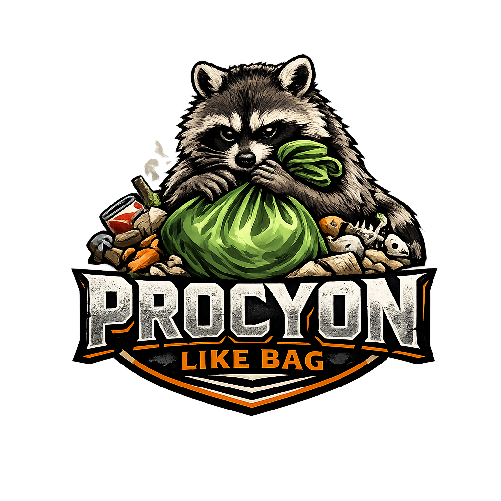

  

  <em>"Badges? We ain't got no badges. We don't need no badges. I don't have to show you any stinking badges."</em> 
  - <em>The Treasure of the Sierra Madre</em>

# Procyon Like Bag

Wtyczka WooCommerce typu API-only dla „ulubionych” (like bag).

Przechowuje ulubione produkty:
- dla gości przez tymczasowy `token` (cookie/header/parametr query),
- dla zalogowanych użytkowników w stabilnym zapisie w bazie danych.

## REST API

Namespace: `procyon-like-bag/v1`

### Session
- `GET /wp-json/procyon-like-bag/v1/session`
- Tworzy token gościa (jeśli potrzebny) i zwraca snapshot like baga.
- Parametry:
  - `include_products` (`bool`, domyślnie `false`)
  - `auto_merge` (`bool`, domyślnie `true`) dla zalogowanych użytkowników z tokenem gościa.

### Lista elementów
- `GET /wp-json/procyon-like-bag/v1/items`
- Parametry:
  - `include_products` (`bool`, domyślnie `false`)

### Dodanie elementu
- `POST /wp-json/procyon-like-bag/v1/items`
- Body:
  - `product_id` (`int`, wymagane)

### Usunięcie elementu
- `DELETE /wp-json/procyon-like-bag/v1/items/{product_id}`

### Przełącznik (toggle) elementu
- `POST /wp-json/procyon-like-bag/v1/toggle`
- Body:
  - `product_id` (`int`, wymagane)

### Czyszczenie like baga
- `DELETE /wp-json/procyon-like-bag/v1/items`

### Licznik
- `GET /wp-json/procyon-like-bag/v1/count`

### Merge gość -> użytkownik
- `POST /wp-json/procyon-like-bag/v1/merge`
- Wymaga zalogowanego użytkownika.
- Opcjonalny parametr body: `token`.

## Obsługa tokenu dla gościa

Token gościa można przekazać przez:
- header: `X-Procyon-Like-Bag-Token`
- parametr requestu: `token`
- cookie: `procyon_like_bag_token`

Gdy token gościa istnieje, odpowiedź API zawiera:
- pole JSON: `token`
- header odpowiedzi: `X-Procyon-Like-Bag-Token`
